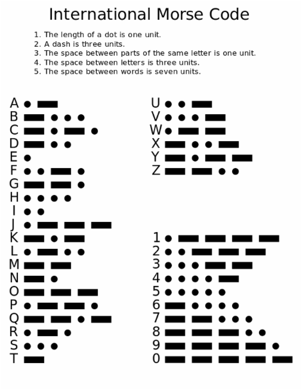

# About Morse Converter App
This repository ("`Morse Converter`") is where I develop the App called Morse Code Converter will assist you in translating any message into morse or from morse to English.
You can discharge a flash from the application in any direction to transmit a message over a long distance using Morse code. 
The application provides a table of all Morse letters and their meanings.

## SnapShot

## Morse Table

